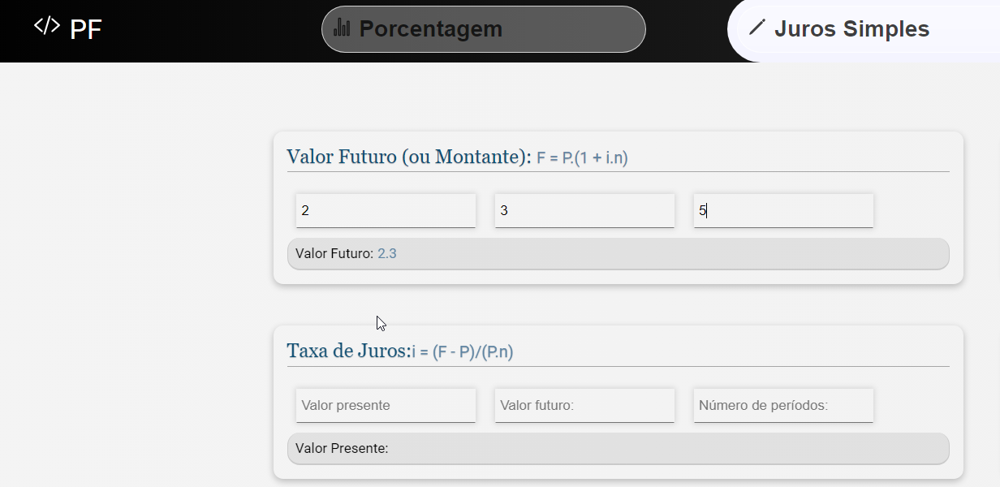

### Página Web, para cálculo de matemática finaceira, incluindo:
* Porcentagem (Margem de Venda, Desconto Percentual)
* Juros Simples (Taxa de Juros, Montante)
* Juros Composto
* Investimentos (Financiamentos, Períodos, Valor Futuro  )

### Setup
* open `index.html`

### Image:

  

